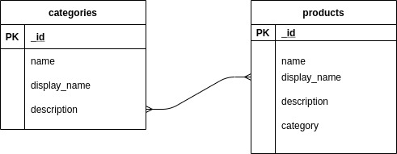

# api-server

## class 6

- Repository Name: `api-server`
- Branch Name: `class-6`

add fake api and test and document it using swagger

## class 7

- Repository Name: `notes`
- Branch Name: `api-server`

now use express to create a real api but save data in memory memory and add test using jest

it took 4.30 hours

### How to Use:

```
node nodes.js
```

## end points

- get: /api/v1/products
- get: /api/v1/products/1
- post: /api/v1/products
- delete: /api/v1/products/1
- put: /api/v1/products/1

- get: /api/v1/categories
- get: /api/v1/categories/1
- post: /api/v1/categories
- delete: /api/v1/categories/1
- put: /api/v1/categories/1

### How to test:

```
Unit Tests: npm run test

Lint Tests: npm run lint
```

## How do I install the app or library?

```
 git clone https://github.com/Mohammad-Eshtaiwi/notes
```


